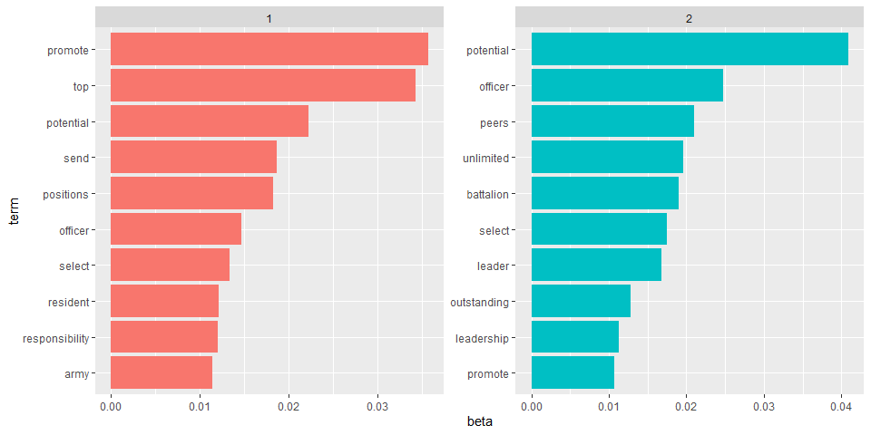
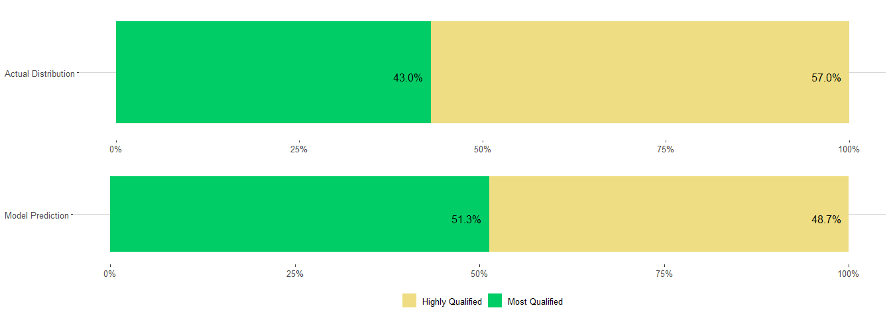

LDA Analysis
================
Heidy Shi
September 24, 2019

LDA on Words in MQ and HQ Narratives
------------------------------------

Create a document term matrix, filtered to keep only the top qualified OERs (MQ and HQ). We know there are two topics, MQ and HQ, so we will build our LDA, with k = 2.

``` r
top_qualified <- c("Most Qualified", "Highly Qualified")
oer_dtm <- tidy_oer_words %>% 
  filter(srLabel %in% top_qualified) %>% 
  cast_dtm(srLabel, srNarrativeWords, n)
oer_lda <- LDA(oer_dtm, k = 2, control = list(seed = 1234))
```

We want to look at `beta`, which is the probability of the term being generated from that topic. Using beta, we can look at the top words, by its `beta` value, for topic 1 and topic 2.

Note: LDA creates these two topics, however we do not know what topic 1 and topic 2 actually represent.

``` r
oer_topics <- tidy(oer_lda, matrix = "beta")

oer_topics %>% group_by(topic) %>% top_n(10, beta) %>% ungroup() %>% arrange(topic, - beta) %>% 
  mutate(term = reorder_within(term, beta, topic)) %>% 
  ggplot(aes(term, beta, fill = factor(topic))) +
  geom_col(show.legend = FALSE) +
  facet_wrap(~topic, scales = "free") +
  coord_flip() +
  scale_x_reordered()
```



LDA by Narrative
----------------

We want to see how well LDA was able to classify each narrative by its topics.

First, we need to clean the data. Filtering the data is done at the beginning so we can add `number` to each narrative. That way, when we unnest tokens, we still know which words came from each narrative to eventually find which topic dominates the narrative based on its words. (Analysis was only done on maneuver branches)

``` r
combat_arms <- c("IN", "AR", "FA")
by_narrative <- oers1 %>% 
  select(branch, srLabel, srNarrative) %>% 
  filter(srLabel %in% top_qualified) %>%
  filter(branch %in% combat_arms) %>% 
  mutate(number = row_number()) %>% 
  unite(document, srLabel, number)

by_narrative_word <- by_narrative %>% unnest_tokens(word, srNarrative)

tidy_narrative_words <- by_narrative_word %>%
  anti_join(stop_words, by = c("word" ="word"))

tidy_narrative_words <- tidy_narrative_words[!grepl(".*xx.*", tidy_narrative_words$word),]

custom_stop_words<-c("i","in","with","an","have", "the", "is", "a", "senior", "rate",
                     "for","to","and","of", "has", "he", "his", "her","she", "be", "career", 
                     "as", "by", "as", "at", "this",
                     "who", "rated", "commander", "command")

tidy_narrative_words <- tidy_narrative_words %>% 
  filter(!word %in% custom_stop_words) %>% 
  count(document, word, sort=TRUE) %>% ungroup()
```

Next, create the document term matrix, this time we will use `gamma` that looks at document probability of falling into one topic or the other.

``` r
narrative_dtm <- tidy_narrative_words %>% cast_dtm(document, word, n)
narrative_lda <- LDA(narrative_dtm, k = 2, control = list(seed = 1234))
narrative_documents <- tidy(narrative_lda, matrix = "gamma")

narrative_documents
```

    ## # A tibble: 41,252 x 3
    ##    document               topic gamma
    ##    <chr>                  <int> <dbl>
    ##  1 Highly Qualified_2023      1 0.518
    ##  2 Highly Qualified_2121      1 0.501
    ##  3 Highly Qualified_4121      1 0.507
    ##  4 Highly Qualified_7814      1 0.482
    ##  5 Most Qualified_18280       1 0.485
    ##  6 Highly Qualified_10719     1 0.475
    ##  7 Highly Qualified_11144     1 0.491
    ##  8 Highly Qualified_1469      1 0.489
    ##  9 Highly Qualified_6996      1 0.480
    ## 10 Highly Qualified_8299      1 0.515
    ## # ... with 41,242 more rows

Create `narrative_classifications` that picks the higher `gamma` and uses that to classify the narrative as either falling in topic 1 or topic 2.

``` r
assignments <- augment(narrative_lda, data = narrative_dtm)

narrative_classifications <- narrative_documents %>% 
  separate(document, c("label", "narrative"), sep = "_", convert = TRUE) %>% 
  group_by(label, narrative) %>% 
  top_n(1, gamma) %>% ungroup()

narrative_classifications
```

    ## # A tibble: 20,626 x 4
    ##    label            narrative topic gamma
    ##    <chr>                <int> <int> <dbl>
    ##  1 Highly Qualified      2023     1 0.518
    ##  2 Highly Qualified      2121     1 0.501
    ##  3 Highly Qualified      4121     1 0.507
    ##  4 Highly Qualified      8299     1 0.515
    ##  5 Most Qualified       16143     1 0.501
    ##  6 Most Qualified        2219     1 0.529
    ##  7 Most Qualified        3645     1 0.508
    ##  8 Highly Qualified     11754     1 0.504
    ##  9 Highly Qualified     11795     1 0.509
    ## 10 Highly Qualified     11951     1 0.506
    ## # ... with 20,616 more rows

We need to get a count of the total number of MQ and HQ narratives falling in topic 1 and falling in topic 2 to create `narrative_topics`. The one that dominates for each topic will be defined as `consensus`. For example, if we have more HQ narratives that fall in topic 1 than MQ narratives, then topic 1 is assigned as being the topic to represent HQ narratives. For our case, HQ is topic 1 and MQ is topic 2.

``` r
narrative_topics <- narrative_classifications %>% count(label, topic) %>% 
  group_by(label) %>% top_n(1, n) %>% 
  ungroup() %>% 
  transmute(consensus = label, topic) #used to determine which topic represents which classification

narrative_topics
```

    ## # A tibble: 2 x 2
    ##   consensus        topic
    ##   <chr>            <int>
    ## 1 Highly Qualified     1
    ## 2 Most Qualified       2

Now we want to see how well were able to cluster by topics. Create `check_classifications` to bind our consensus results with our `narrative_classifications` by `topic`.

``` r
check_classifications <- narrative_classifications %>% 
  inner_join(narrative_topics, by = c("topic" = "topic"))
check_classifications %>% 
  filter(label != consensus) %>% count(label, consensus) 
```

    ## # A tibble: 2 x 3
    ##   label            consensus            n
    ##   <chr>            <chr>            <int>
    ## 1 Highly Qualified Most Qualified    5506
    ## 2 Most Qualified   Highly Qualified  3785

We can see that we incorrecty put 5506 HQ narratives into MQ bin and incorrectly put 3785 MQ narratives into HQ bin.

``` r
check_classifications %>% 
  filter(label == consensus) %>% 
  count(label, consensus) 
```

    ## # A tibble: 2 x 3
    ##   label            consensus            n
    ##   <chr>            <chr>            <int>
    ## 1 Highly Qualified Highly Qualified  6256
    ## 2 Most Qualified   Most Qualified    5079

We correctly put 6256 HQ narratives into the HQ bin and 5079 MQ narratives into the MQ bin.

Now lets see how well we were able to assign topics to documents based on individal words and see what words made it difficult to assign topics.

``` r
assignments1 <- assignments %>% 
  separate(document, c("label", "narrative"), sep = "_", convert = TRUE) %>% 
  inner_join(narrative_topics, by = c(".topic" = "topic"))

#Wrong words that put us in the wrong cluster, should be the common words across the two labels
wrong_words <- assignments1 %>% 
  select(-c(narrative)) %>% 
  filter(label != consensus) %>% 
  group_by(label, consensus, term) %>% 
  count(term, sort = TRUE) %>% ungroup() %>% 
  group_by(label) %>% arrange(desc(n))

wrong_words
```

    ## # A tibble: 7,239 x 4
    ## # Groups:   label [2]
    ##    label            consensus        term          n
    ##    <chr>            <chr>            <chr>     <int>
    ##  1 Most Qualified   Highly Qualified potential  6420
    ##  2 Highly Qualified Most Qualified   promote    6375
    ##  3 Highly Qualified Most Qualified   top        5789
    ##  4 Most Qualified   Highly Qualified officer    3616
    ##  5 Highly Qualified Most Qualified   unlimited  3595
    ##  6 Highly Qualified Most Qualified   battalion  3571
    ##  7 Most Qualified   Highly Qualified select     3539
    ##  8 Highly Qualified Most Qualified   company    3134
    ##  9 Most Qualified   Highly Qualified peers      3057
    ## 10 Highly Qualified Most Qualified   positions  2900
    ## # ... with 7,229 more rows

Top words that contributed to incorrectly classifying our narratives.

``` r
grid.arrange(
  wrong_words %>% top_n(10) %>% 
    arrange(desc(label)) %>% 
    ungroup() %>% 
    filter(label == "Highly Qualified") %>%
    mutate(term = reorder(term, n)) %>% 
    ggplot(aes(term, n, fill = label)) +
    geom_col(fill = "lightgoldenrod", show.legend = FALSE) +
    #facet_wrap(~label, ncol = 2, scales = "free") +
    labs(x = NULL, y = "count") +
    coord_flip () +
    theme_hc() +
    ggtitle("HQ Words That Incorrectly Classified the Narrative as MQ"),
  
    wrong_words %>% top_n(10) %>% 
    arrange(desc(label)) %>%
    ungroup() %>% 
    filter(label == "Most Qualified") %>% 
    mutate(term = reorder(term, n)) %>% 
    ggplot(aes(term, n, fill = label)) +
    geom_col(fill = "springgreen3", show.legend = FALSE) +
    #facet_wrap(~label, ncol = 2, scales = "free") +
    labs(x = NULL, y = "count") +
    coord_flip () +
    theme_hc() +
    ggtitle("MQ Words That Incorrectly Classified the Narrative as HQ"),
  
  ncol = 2)
```


