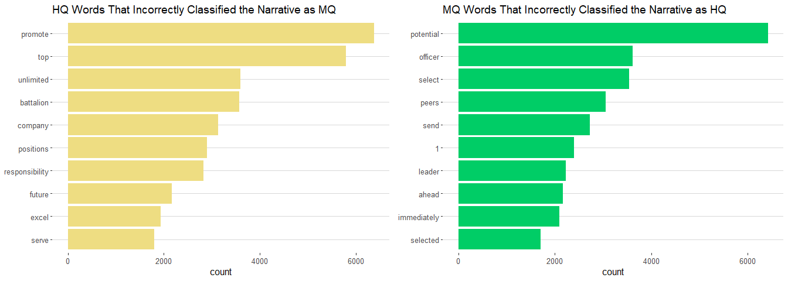

LDA Analysis
================
Heidy Shi
September 24, 2019

LDA on Words in MQ and HQ Narratives
------------------------------------

Create a document term matrix, filtered to keep only the top qualified OERs (MQ and HQ). We know there are two topics, MQ and HQ, so we will build our LDA, with k = 2.

``` r
top_qualified <- c("Most Qualified", "Highly Qualified")
oer_dtm <- tidy_oer_words %>% 
  filter(srLabel %in% top_qualified) %>% 
  cast_dtm(srLabel, srNarrativeWords, n)
oer_lda <- LDA(oer_dtm, k = 2, control = list(seed = 1234))
```

We want to look at `beta`, which is the probability of the term being generated from that topic. Using beta, we can look at the top words, by its `beta` value, for topic 1 and topic 2.

Note: LDA creates these two topics, however we do not know what topic 1 and topic 2 actually represent.

``` r
oer_topics <- tidy(oer_lda, matrix = "beta")

oer_topics %>% group_by(topic) %>% top_n(10, beta) %>% ungroup() %>% arrange(topic, - beta) %>% 
  mutate(term = reorder_within(term, beta, topic)) %>% 
  ggplot(aes(term, beta, fill = factor(topic))) +
  geom_col(show.legend = FALSE) +
  facet_wrap(~topic, scales = "free") +
  coord_flip() +
  scale_x_reordered()
```


LDA by Narrative
----------------

We want to see how well LDA was able to classify each narrative by its topics.

First, we need to clean the data. Filtering the data is done at the beginning so we can add `number` to each narrative. That way, when we unnest tokens, we still know which words came from each narrative to eventually find which topic dominates the narrative based on its words. (Analysis was only done on maneuver branches)

``` r
combat_arms <- c("IN", "AR", "FA")
by_narrative <- oers1 %>% 
  select(branch, srLabel, srNarrative) %>% 
  filter(srLabel %in% top_qualified) %>%
  filter(branch %in% combat_arms) %>% 
  mutate(number = row_number()) %>% 
  unite(document, srLabel, number)

by_narrative_word <- by_narrative %>% unnest_tokens(word, srNarrative)

tidy_narrative_words <- by_narrative_word %>%
  anti_join(stop_words, by = c("word" ="word"))

tidy_narrative_words <- tidy_narrative_words[!grepl(".*xx.*", tidy_narrative_words$word),]

custom_stop_words<-c("i","in","with","an","have", "the", "is", "a", "senior", "rate",
                     "for","to","and","of", "has", "he", "his", "her","she", "be", "career", 
                     "as", "by", "as", "at", "this",
                     "who", "rated", "commander", "command")

tidy_narrative_words <- tidy_narrative_words %>% 
  filter(!word %in% custom_stop_words) %>% 
  count(document, word, sort=TRUE) %>% ungroup()
```

Next, create the document term matrix, this time we will use `gamma` that looks at document probability of falling into one topic or the other.

``` r
narrative_dtm <- tidy_narrative_words %>% cast_dtm(document, word, n)
narrative_lda <- LDA(narrative_dtm, k = 2, control = list(seed = 1234))
narrative_documents <- tidy(narrative_lda, matrix = "gamma")

narrative_documents %>% arrange(document)
```

    ## # A tibble: 41,252 x 3
    ##    document               topic gamma
    ##    <chr>                  <int> <dbl>
    ##  1 Highly Qualified_10        1 0.507
    ##  2 Highly Qualified_10        2 0.493
    ##  3 Highly Qualified_100       1 0.488
    ##  4 Highly Qualified_100       2 0.512
    ##  5 Highly Qualified_10002     1 0.507
    ##  6 Highly Qualified_10002     2 0.493
    ##  7 Highly Qualified_10003     1 0.491
    ##  8 Highly Qualified_10003     2 0.509
    ##  9 Highly Qualified_10004     1 0.492
    ## 10 Highly Qualified_10004     2 0.508
    ## # ... with 41,242 more rows

Create `narrative_classifications` that picks the higher `gamma` and uses that to classify the narrative as either falling in topic 1 or topic 2.

``` r
narrative_classifications <- narrative_documents %>% 
  separate(document, c("label", "narrative"), sep = "_", convert = TRUE) %>% 
  group_by(label, narrative) %>% 
  top_n(1, gamma) %>% ungroup()

narrative_classifications
```

    ## # A tibble: 20,626 x 4
    ##    label            narrative topic gamma
    ##    <chr>                <int> <int> <dbl>
    ##  1 Highly Qualified      2023     1 0.518
    ##  2 Highly Qualified      2121     1 0.501
    ##  3 Highly Qualified      4121     1 0.507
    ##  4 Highly Qualified      8299     1 0.515
    ##  5 Most Qualified       16143     1 0.501
    ##  6 Most Qualified        2219     1 0.529
    ##  7 Most Qualified        3645     1 0.508
    ##  8 Highly Qualified     11754     1 0.504
    ##  9 Highly Qualified     11795     1 0.509
    ## 10 Highly Qualified     11951     1 0.506
    ## # ... with 20,616 more rows

We need to get a count of the total number of MQ and HQ narratives falling in topic 1 and falling in topic 2 to create `narrative_topics`. The one that dominates for each topic will be defined as `consensus`. For example, if we have more HQ narratives that fall in topic 1 than MQ narratives, then topic 1 is assigned as being the topic to represent HQ narratives. For our case, HQ is topic 1 and MQ is topic 2.

``` r
narrative_topics <- narrative_classifications %>% count(label, topic) %>% 
  group_by(label) %>% top_n(1, n) %>% 
  ungroup() %>% 
  transmute(consensus = label, topic) #used to determine which topic represents which classification

narrative_topics
```

    ## # A tibble: 2 x 2
    ##   consensus        topic
    ##   <chr>            <int>
    ## 1 Highly Qualified     1
    ## 2 Most Qualified       2

Now we want to see how well were able to cluster by topics. Create `check_classifications` to bind our consensus results with our `narrative_classifications` by `topic`.

``` r
check_classifications <- narrative_classifications %>% 
  inner_join(narrative_topics, by = c("topic" = "topic"))
check_classifications %>% 
  filter(label != consensus) %>% count(label, consensus) 
```

    ## # A tibble: 2 x 3
    ##   label            consensus            n
    ##   <chr>            <chr>            <int>
    ## 1 Highly Qualified Most Qualified    5506
    ## 2 Most Qualified   Highly Qualified  3785

We can see that we incorrecty put 5506 HQ narratives into MQ bin and incorrectly put 3785 MQ narratives into HQ bin.

``` r
check_classifications %>% 
  filter(label == consensus) %>% 
  count(label, consensus) 
```

    ## # A tibble: 2 x 3
    ##   label            consensus            n
    ##   <chr>            <chr>            <int>
    ## 1 Highly Qualified Highly Qualified  6256
    ## 2 Most Qualified   Most Qualified    5079

We correctly put 6256 HQ narratives into the HQ bin and 5079 MQ narratives into the MQ bin.

Now lets see how well we were able to assign topics to documents based on individal words and see what words made it difficult to assign topics. We use `augment` to see what words were classified into each topic that contributed to the document being assigned to its respective topic.

``` r
assignments <- augment(narrative_lda, data = narrative_dtm)

assignments1 <- assignments %>% 
  separate(document, c("label", "narrative"), sep = "_", convert = TRUE) %>% 
  inner_join(narrative_topics, by = c(".topic" = "topic"))

#Wrong words that put us in the wrong cluster
wrong_words <- assignments1 %>% 
  select(-c(narrative)) %>% 
  filter(label != consensus) %>% 
  group_by(label, consensus, term) %>% 
  count(term, sort = TRUE) %>% ungroup() %>% 
  group_by(label) %>% arrange(desc(n))

wrong_words
```

    ## # A tibble: 7,239 x 4
    ## # Groups:   label [2]
    ##    label            consensus        term          n
    ##    <chr>            <chr>            <chr>     <int>
    ##  1 Most Qualified   Highly Qualified potential  6420
    ##  2 Highly Qualified Most Qualified   promote    6375
    ##  3 Highly Qualified Most Qualified   top        5789
    ##  4 Most Qualified   Highly Qualified officer    3616
    ##  5 Highly Qualified Most Qualified   unlimited  3595
    ##  6 Highly Qualified Most Qualified   battalion  3571
    ##  7 Most Qualified   Highly Qualified select     3539
    ##  8 Highly Qualified Most Qualified   company    3134
    ##  9 Most Qualified   Highly Qualified peers      3057
    ## 10 Highly Qualified Most Qualified   positions  2900
    ## # ... with 7,229 more rows

Top words that contributed to incorrectly classifying our narratives.

``` r
grid.arrange(
  wrong_words %>% top_n(10) %>% 
    arrange(desc(label)) %>% 
    ungroup() %>% 
    filter(label == "Highly Qualified") %>%
    mutate(term = reorder(term, n)) %>% 
    ggplot(aes(term, n, fill = label)) +
    geom_col(fill = "lightgoldenrod", show.legend = FALSE) +
    #facet_wrap(~label, ncol = 2, scales = "free") +
    labs(x = NULL, y = "count") +
    coord_flip () +
    theme_hc() +
    ggtitle("HQ Words That Incorrectly Classified the Narrative as MQ"),
  
    wrong_words %>% top_n(10) %>% 
    arrange(desc(label)) %>%
    ungroup() %>% 
    filter(label == "Most Qualified") %>% 
    mutate(term = reorder(term, n)) %>% 
    ggplot(aes(term, n, fill = label)) +
    geom_col(fill = "springgreen3", show.legend = FALSE) +
    #facet_wrap(~label, ncol = 2, scales = "free") +
    labs(x = NULL, y = "count") +
    coord_flip () +
    theme_hc() +
    ggtitle("MQ Words That Incorrectly Classified the Narrative as HQ"),
  
  ncol = 2)
```


LDA Using Bigrams in MQ and HQ Narratives
-----------------------------------------

``` r
bigram_senior <- oers1 %>% unnest_tokens(bigram, srNarrative, token = "ngrams", n=2)
bigram_separated <- bigram_senior %>% separate(bigram, c("word1", "word2"), sep = " ")
bigram_separated <- bigram_separated[!grepl(".*xx.*", bigram_separated$word1),] 
bigram_separated <- bigram_separated[!grepl(".*xx.*", bigram_separated$word2),]

custom_stop_words<-c("i","in","with","an","have", "the", "is", "a", "senior", "rate",
                     "for","to","and","of", "has", "he", "his", "her","she", "be", "career", "as", "by", "as", "at", "this",
                     "who", "rated", "commander", "command")

bigram_filter <- bigram_separated %>% 
  filter(!word1 %in% stop_words$word) %>% 
  filter(!word2 %in% stop_words$word) %>% 
  filter(!word1 %in% custom_stop_words) %>% 
  filter(!word2 %in% custom_stop_words)
```

Create a document term matrix, filterd to keep only top qualified OERs.

``` r
top_qualified <- c("Most Qualified", "Highly Qualified")
tidy_bigrams <- bigram_filter %>% 
  filter(branch %in% combat_arms) %>% 
  unite(bigram, word1, word2, sep = " ") %>% 
  count(srLabel, bigram, sort = TRUE)
tidy_bigrams$srLabel <- as.character(tidy_bigrams$srLabel)
oer_bigram_dtm<- tidy_bigrams %>% 
  filter(srLabel %in% top_qualified) %>% 
  cast_dtm(srLabel, bigram, n)
bigram_lda <- LDA(oer_bigram_dtm, k = 2, control = list(seed = 1234))
```

We want to look at `beta` once again, which is the probability that the bigram is generated from that topic.

``` r
oer_bigram_topics <- tidy(bigram_lda, matrix = "beta")

topic.labs <- c("Topic 1", "Topic 2")
names(topic.labs) <- c("1", "2")

oer_bigram_topics %>% group_by(topic) %>% top_n(10, beta) %>% 
  ungroup() %>% arrange(topic, - beta) %>% 
  mutate(term = reorder_within(term, beta, topic)) %>% 
  ggplot(aes(term, beta, fill = factor(topic))) +
  geom_col(show.legend = FALSE) +
  facet_wrap(~topic, labeller = labeller(topic = topic.labs), scales = "free") +
  theme_hc() +
  coord_flip() +
  scale_x_reordered() +
  labs(x = NULL, y = "beta")
```



``` r
beta_spread <- oer_bigram_topics %>% mutate(topic = paste0("topic", topic)) %>% 
  spread(topic, beta) %>% 
  filter(topic1 > 0.001 | topic2 >0.001) %>% 
  mutate(log_ratio = log2(topic2 / topic1))

beta_spread_ordered <- beta_spread %>% mutate(abs = abs(log_ratio)) %>% 
  arrange(desc(abs)) %>% top_n(20) %>% arrange((log_ratio)) %>% 
  mutate(order = row_number())

beta_spread_ordered %>% ggplot(aes(order, log_ratio)) +
  geom_bar(stat = 'identity', show.legend = FALSE, fill = "cadetblue3") +
  theme_hc() +
  coord_flip() +
  scale_x_reordered() +
  labs(x = NULL, y = "Log2 Ratio of Beta in Topic 2/Topic1") +
  scale_colour_hc()+
  scale_fill_hc() +
  scale_x_continuous(
    breaks = beta_spread_ordered$order,
    labels = paste0(beta_spread_ordered$term),
    expand = c(0,0)
  )
```


LDA by Narrative Using Bigrams
------------------------------

Clean the data, unnest by bigrams.

``` r
by_narrative_bigram <- by_narrative %>% unnest_tokens(bigram, srNarrative, token = "ngrams", n=2)

by_narrative_bigram_separated <- by_narrative_bigram %>% 
  separate(bigram, c("word1", "word2"), sep = " ")
by_narrative_bigram_separated <- 
  by_narrative_bigram_separated[!grepl(".*xx.*", by_narrative_bigram_separated$word1),] 
by_narrative_bigram_separated <- 
  by_narrative_bigram_separated[!grepl(".*xx.*", by_narrative_bigram_separated$word2),]

custom_stop_words<-c("i","in","with","an","have", "the", "is", "a", "senior", "rate",
                     "for","to","and","of", "has", "he", "his", "her","she", "be", 
                     "career", "as", "by", "as", "at", "this",
                     "who", "rated", "commander", "command")
bigram_narrative_filter <- by_narrative_bigram_separated %>% 
  filter(!word1 %in% stop_words$word) %>% 
  filter(!word2 %in% stop_words$word) %>% 
  filter(!word1 %in% custom_stop_words) %>% 
  filter(!word2 %in% custom_stop_words)

tidy_narrative_bigram <- bigram_narrative_filter %>% 
  unite(bigram, word1, word2, sep = " ") %>% 
  count(document, bigram, sort=TRUE) %>% ungroup()
```

Next, create the document term matrix and use `gamma` to analyze document probability.

``` r
narrative_bigram_dtm <- tidy_narrative_bigram %>% cast_dtm(document, bigram, n)
narrative_bigram_lda <- LDA(narrative_bigram_dtm, k = 2, control = list(seed = 1234))
narrative_bigram_documents <- tidy(narrative_bigram_lda, matrix = "gamma")
narrative_bigram_documents %>% arrange(document)
```

    ## # A tibble: 41,220 x 3
    ##    document               topic gamma
    ##    <chr>                  <int> <dbl>
    ##  1 Highly Qualified_10        1 0.508
    ##  2 Highly Qualified_10        2 0.492
    ##  3 Highly Qualified_100       1 0.509
    ##  4 Highly Qualified_100       2 0.491
    ##  5 Highly Qualified_10002     1 0.503
    ##  6 Highly Qualified_10002     2 0.497
    ##  7 Highly Qualified_10003     1 0.501
    ##  8 Highly Qualified_10003     2 0.499
    ##  9 Highly Qualified_10004     1 0.501
    ## 10 Highly Qualified_10004     2 0.499
    ## # ... with 41,210 more rows

Create classifications for bigrams that will pick the higher `gamma` to classify the narrative as either falling in topic 1 or topic 2.

``` r
narrative_bigram_classifications <- narrative_bigram_documents %>% 
  separate(document, c("label", "narrative"), sep = "_", convert = TRUE) %>% 
  group_by(label, narrative) %>% 
  top_n(1, gamma) %>% ungroup()
narrative_bigram_classifications
```

    ## # A tibble: 20,610 x 4
    ##    label            narrative topic gamma
    ##    <chr>                <int> <int> <dbl>
    ##  1 Highly Qualified     12530     1 0.516
    ##  2 Highly Qualified     14918     1 0.504
    ##  3 Highly Qualified     15102     1 0.500
    ##  4 Highly Qualified     17087     1 0.507
    ##  5 Highly Qualified     18262     1 0.517
    ##  6 Highly Qualified     19954     1 0.514
    ##  7 Highly Qualified      4210     1 0.514
    ##  8 Highly Qualified      4275     1 0.512
    ##  9 Highly Qualified      4593     1 0.502
    ## 10 Highly Qualified       558     1 0.515
    ## # ... with 20,600 more rows

Get a count of total number of MQ and HQ narratives falling in either topic 1 or topic 2

``` r
narrative_bigram_topics <- narrative_bigram_classifications %>% count(label, topic) %>% 
  group_by(label) %>% arrange(n) %>% top_n(1, n) %>% 
  ungroup() %>% 
  transmute(consensus = label, topic) #used to determine which topic represents which classification
narrative_bigram_topics
```

    ## # A tibble: 2 x 2
    ##   consensus        topic
    ##   <chr>            <int>
    ## 1 Most Qualified       2
    ## 2 Highly Qualified     1

See how well we were able to cluster topics by checking the classifications.

``` r
#see how well we were able to cluster by topics (mq and hq)
check_classifications <- narrative_bigram_classifications %>% 
  inner_join(narrative_bigram_topics, by = c("topic" = "topic"))
check_classifications$label <- as.factor(check_classifications$label)
check_classifications$consensus <- as.factor(check_classifications$consensus)
incorrect <- check_classifications %>% filter(label != consensus) %>% count(label, consensus)
incorrect
```

    ## # A tibble: 2 x 3
    ##   label            consensus            n
    ##   <fct>            <fct>            <int>
    ## 1 Highly Qualified Most Qualified    5758
    ## 2 Most Qualified   Highly Qualified  4275

The model incorrecty put 5993 HQ narratives into MQ bin, put 4584 MQ narratives into HQ bin

``` r
correct <- check_classifications %>% filter(label == consensus) %>% count(label, consensus)
correct
```

    ## # A tibble: 2 x 3
    ##   label            consensus            n
    ##   <fct>            <fct>            <int>
    ## 1 Highly Qualified Highly Qualified  5993
    ## 2 Most Qualified   Most Qualified    4584

The model correctly put 5758 HQ into the HQ bin and 4275 MQ into the MQ bin.

Now we can build a confusion matrix and analyze how well the model performed.

``` r
confusionMatrix(check_classifications$consensus, check_classifications$label)
```

    ## Confusion Matrix and Statistics
    ## 
    ##                   Reference
    ## Prediction         Highly Qualified Most Qualified
    ##   Highly Qualified             5993           4275
    ##   Most Qualified               5758           4584
    ##                                           
    ##                Accuracy : 0.5132          
    ##                  95% CI : (0.5063, 0.52)  
    ##     No Information Rate : 0.5702          
    ##     P-Value [Acc > NIR] : 1               
    ##                                           
    ##                   Kappa : 0.0269          
    ##                                           
    ##  Mcnemar's Test P-Value : <2e-16          
    ##                                           
    ##             Sensitivity : 0.5100          
    ##             Specificity : 0.5174          
    ##          Pos Pred Value : 0.5837          
    ##          Neg Pred Value : 0.4432          
    ##              Prevalence : 0.5702          
    ##          Detection Rate : 0.2908          
    ##    Detection Prevalence : 0.4982          
    ##       Balanced Accuracy : 0.5137          
    ##                                           
    ##        'Positive' Class : Highly Qualified
    ## 

Model had a 51% accuracy, and a 51% sensitivity, and a 51% specificity.

Plot shows a breakdown of how the model predicted as either being MQ or HQ.

``` r
grid.arrange(
check_classifications %>% count(label) %>% mutate(srLabel = "Actual Distribution") %>% 
  mutate(pct = n/sum(n)) %>% 
  ggplot(aes(x = srLabel, y= pct, fill = label)) +
  geom_bar(stat = "identity", show.legend = FALSE) +
  geom_text_repel(aes(label = scales::percent(pct)), position = "stack",
                  size = 4.25, hjust = 1.25, vjust = 1) +
  theme_hc() +
  scale_colour_hc()+
  scale_fill_hc()+
  #xlab("Predicted")+
  #ylab("Percentage")+
  labs(x = NULL, y = NULL, fill = "")+
  #ggtitle("Distribution of OERS in 2017") + 
  scale_y_continuous(labels=percent) +
  scale_fill_manual(values=c("Most Qualified"="springgreen3", "Highly Qualified"="lightgoldenrod")) +
  coord_flip(),

check_classifications %>% count(consensus) %>% mutate(srLabel = "Model Prediction") %>% 
  mutate(pct = n/sum(n)) %>% 
  ggplot(aes(x = srLabel, y= pct, fill = consensus)) +
  geom_bar(stat = "identity") +
  geom_text_repel(aes(label = scales::percent(pct, accuracy = 0.1)), position = "stack",
                  size = 4.25, hjust = 1.25, vjust = 1) +
  #geom_text_repel(aes(label = paste(as.character(signif(100*pct, 3))) + "%"), position = "stack",
                  #size = 4.25, hjust = 1.25, vjust = 1) +
  theme_hc() +
  scale_colour_hc()+
  scale_fill_hc()+
  #xlab("Predicted")+
  #ylab("Percentage Predicted")+
  labs(x = NULL, y = NULL, fill = "")+
  #ggtitle("Distribution of OERS in 2017") + 
  scale_y_continuous(labels=percent) +
  scale_fill_manual(values=c("Most Qualified"="springgreen3", "Highly Qualified"="lightgoldenrod")) +
  coord_flip(),
nrow = 2)
```


See how well we were able to cluster, based on individual words

``` r
assignments <- augment(narrative_bigram_lda, data = narrative_bigram_dtm)

assignments1 <- assignments %>% 
  separate(document, c("label", "narrative"), sep = "_", convert = TRUE) %>% 
  inner_join(narrative_bigram_topics, by = c(".topic" = "topic"))

assignments1 %>% group_by(label, consensus, term) %>% 
  count(term, sort = TRUE) %>% 
  ungroup %>% group_by(consensus) %>% filter(n >= 50) %>% top_n(20)
```

    ## # A tibble: 40 x 4
    ## # Groups:   consensus [2]
    ##    label            consensus        term                         n
    ##    <chr>            <chr>            <chr>                    <int>
    ##  1 Most Qualified   Most Qualified   unlimited potential       3559
    ##  2 Highly Qualified Most Qualified   unlimited potential       3275
    ##  3 Most Qualified   Highly Qualified promote ahead             1087
    ##  4 Most Qualified   Most Qualified   field grade               1071
    ##  5 Highly Qualified Highly Qualified top 10                    1025
    ##  6 Most Qualified   Most Qualified   resident ile              1023
    ##  7 Highly Qualified Most Qualified   increased responsibility   995
    ##  8 Highly Qualified Most Qualified   field grade                975
    ##  9 Most Qualified   Highly Qualified top 10                     954
    ## 10 Most Qualified   Most Qualified   top 5                      890
    ## # ... with 30 more rows

``` r
wrong_bigrams <- assignments1 %>% select(-c(narrative)) %>% 
  filter(label != consensus) %>% 
  group_by(label, consensus, term) %>% 
  count(term, sort = TRUE) %>% ungroup() %>% 
  group_by(label) %>% arrange(desc(n))

wrong_bigrams
```

    ## # A tibble: 30,476 x 4
    ## # Groups:   label [2]
    ##    label            consensus        term                         n
    ##    <chr>            <chr>            <chr>                    <int>
    ##  1 Highly Qualified Most Qualified   unlimited potential       3275
    ##  2 Most Qualified   Highly Qualified promote ahead             1087
    ##  3 Highly Qualified Most Qualified   increased responsibility   995
    ##  4 Highly Qualified Most Qualified   field grade                975
    ##  5 Most Qualified   Highly Qualified top 10                     954
    ##  6 Most Qualified   Highly Qualified resident cgsc              761
    ##  7 Highly Qualified Most Qualified   resident ile               696
    ##  8 Most Qualified   Highly Qualified future battalion           651
    ##  9 Highly Qualified Most Qualified   rating period              636
    ## 10 Most Qualified   Highly Qualified potential promote          603
    ## # ... with 30,466 more rows

Top bigrams that contributed incorrectly to classifying our narratives.

``` r
grid.arrange(
  wrong_bigrams %>% top_n(10) %>% 
    arrange(desc(label)) %>% 
    ungroup() %>% 
    filter(label == "Highly Qualified") %>%
    mutate(term = reorder(term, n)) %>% 
    ggplot(aes(term, n, fill = label)) +
    geom_col(fill = "lightgoldenrod", show.legend = FALSE) +
    #facet_wrap(~label, ncol = 2, scales = "free") +
    labs(x = NULL, y = "count") +
    coord_flip () +
    theme_hc() +
    ggtitle("HQ Words That Incorrectly Classified the Narrative as MQ"),
  
    wrong_bigrams %>% top_n(10) %>% 
    arrange(desc(label)) %>%
    ungroup() %>% 
    filter(label == "Most Qualified") %>% 
    mutate(term = reorder(term, n)) %>% 
    ggplot(aes(term, n, fill = label)) +
    geom_col(fill = "springgreen3", show.legend = FALSE) +
    #facet_wrap(~label, ncol = 2, scales = "free") +
    labs(x = NULL, y = "count") +
    coord_flip () +
    theme_hc() +
    ggtitle("MQ Words That Incorrectly Classified the Narrative as HQ"),
  
  ncol = 2)
```


