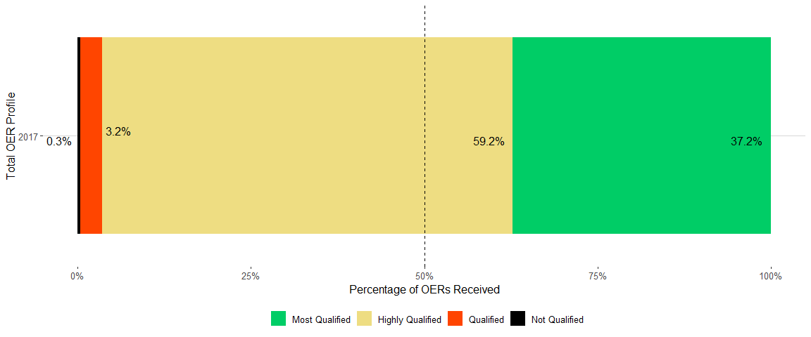
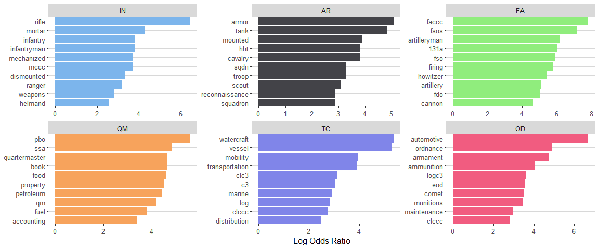
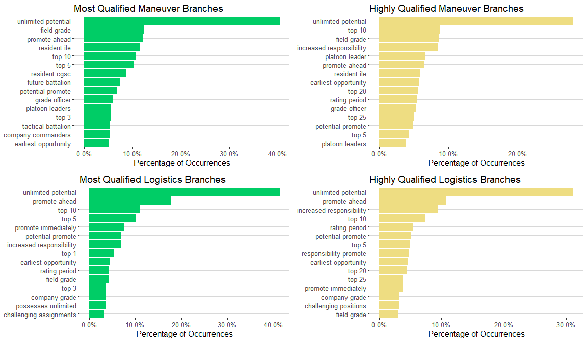
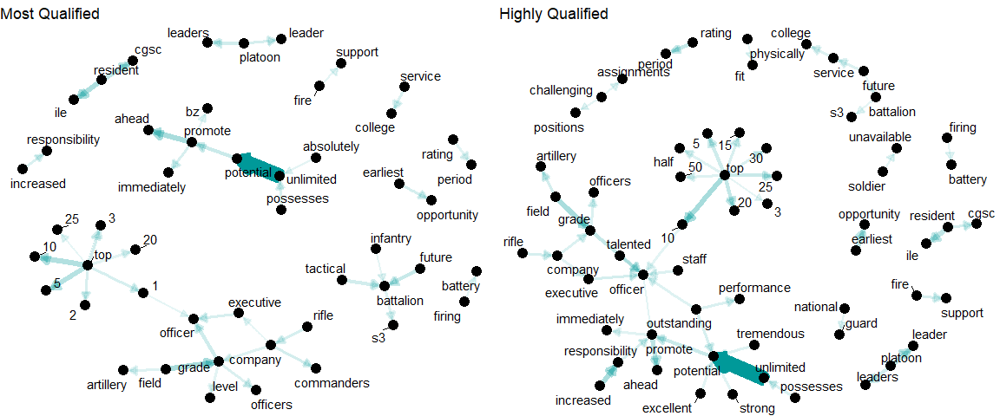
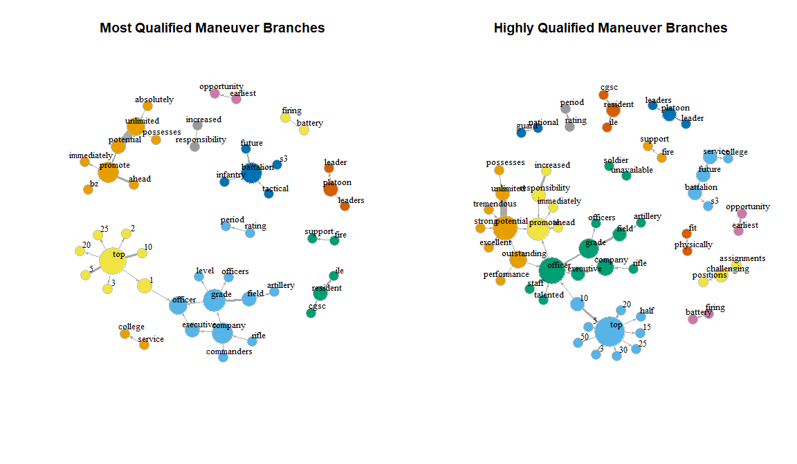

OER\_Plots
================
Heidy Shi
September 18, 2019

General OER Analysis
====================

Total Number of OERs in 2017 by Branch
--------------------------------------

``` r
ggplot(data = oers1_pect, mapping = aes(x = reorder(branch, -count), y = count, fill = srLabel))+
  geom_bar(stat = "identity")+
  labs(y = "Number of OERs", x = "Branch", fill = "Block Check Rating")+
  theme_minimal()+
  scale_fill_manual(values=c("Most Qualified"="springgreen3", 
                             "Highly Qualified"="lightgoldenrod", 
                             "Qualified"="orangered1", "Not Qualified"="firebrick"))
```


Distribution of OERs by Senior Rater Label Block Check
------------------------------------------------------

``` r
ggplot(data = oers1c,mapping = aes(x = year, y= pct,fill = srLabel))+
  geom_bar(stat = "identity")+
  geom_text_repel(aes(label = scales::percent(pct)), position = "stack",
                  size = 4.25, hjust = 1.25, vjust = 1) +
  #geom_text_repel(aes(label = paste(as.character(signif(100*pct, 3))) + "%"), position = "stack",
                  #size = 4.25, hjust = 1.25, vjust = 1)+
  geom_abline(intercept = .5, slope = 0, linetype = 2)+
  theme_hc() +
  scale_colour_hc()+
  scale_fill_hc()+
  xlab("Total OER Profile")+
  ylab("Percentage of OERs Received")+
  labs(fill = "")+
  #ggtitle("Distribution of OERS in 2017") + 
  scale_y_continuous(labels=percent) +
  scale_fill_manual(values=c("Most Qualified"="springgreen3", 
                             "Highly Qualified"="lightgoldenrod", 
                             "Qualified"="orangered1", "Not Qualified"="firebrick")) +
  coord_flip()
```



Distribution of OERs Across Base Branches
-----------------------------------------

``` r
ggplot(data = oers1b,mapping = aes(x = branch, y= pct,fill = srLabel))+
  geom_bar(stat= "identity")+
  geom_abline(intercept = .5, slope = 0, linetype = 2)+
  theme_hc() +
  scale_colour_hc()+
  scale_fill_hc()+
  xlab("Branch")+
  ylab("Percentage of OERs Received")+
  labs(fill = "")+
  #ggtitle("Distribution of OERS for Braches with Greater than 100 OERS in 2017") +
  scale_y_continuous(labels=percent)+
  scale_fill_manual(values=c("Most Qualified"="springgreen3", 
                             "Highly Qualified"="lightgoldenrod", 
                             "Qualified"="orangered1", "Not Qualified"="firebrick"))
```


Text Analysis
=============

TF-IDF Plot
-----------

``` r
tf_idf_word_plot <- ggplot(combined_tf_ordered, aes(order, tf_idf, fill = branch)) +
  geom_bar(stat = 'identity', show.legend = FALSE) +
  labs(x = NULL, y = "tf-idf") +
  facet_wrap(~branch, ncol = 3, scales = "free") +
  theme_hc() +
  coord_flip()+
  scale_colour_hc()+
  scale_fill_hc() +
  scale_x_continuous(
    breaks = combined_tf_ordered$order,
    labels = paste0(combined_tf_ordered$srNarrativeWords),
    expand = c(0,0)
  ) +
  ggtitle("Tf-Idf By Branch")

tf_idf_word_plot
```


Log Odds (By Hand, Unweighted)
------------------------------

``` r
unweighted_log_odds_plot <- ggplot(unweighted_log_odds_ordered, aes(order, logoddsratio, fill = branch)) +
  geom_bar(stat = 'identity', show.legend = FALSE) +
  labs(x = NULL, y = "log_odds") +
  facet_wrap(~branch, ncol = 3, scales = "free") +
  theme_hc() +
  coord_flip()+
  scale_colour_hc()+
  scale_fill_hc() +
  scale_x_continuous(
    breaks = unweighted_log_odds_ordered$order,
    labels = paste0(unweighted_log_odds_ordered$srNarrativeWords),
    expand = c(0,0)
  ) +
  ggtitle("Unweighted Log-Odds Ratio By Branch")

unweighted_log_odds_plot
```



Weighted Log Odds Using bind\_log\_odds from tidylo package
-----------------------------------------------------------

Tidylo package can be found [here](https://github.com/juliasilge/tidylo). Uses the weighted log odds outlined in the method in [Monroe, Colaresi, and Quinn](https://www.cambridge.org/core/journals/political-analysis/article/fightin-words-lexical-feature-selection-and-evaluation-for-identifying-the-content-of-political-conflict/81B3703230D21620B81EB6E2266C7A66) Link to the "bind\_log\_odds" function is [here](https://github.com/juliasilge/tidylo/blob/master/R/bind_log_odds.R)

``` r
word_log_odds_plot <- ggplot(word_log_odds_ordered, aes(order, log_odds, fill = branch)) +
  geom_bar(stat = 'identity', show.legend = FALSE) +
  labs(x = NULL, y = "log_odds") +
  facet_wrap(~branch, ncol = 3, scales = "free") +
  theme_hc() +
  coord_flip()+
  scale_colour_hc()+
  scale_fill_hc() +
  scale_x_continuous(
    breaks = word_log_odds_ordered$order,
    labels = paste0(word_log_odds_ordered$srNarrativeWords),
    expand = c(0,0)
    ) +
  ggtitle("Weighted Log-Odds By Branch")

word_log_odds_plot
```


Bigrams
=======

``` r
unweighted_log_odds_bigrams_ordered_plot_combat <- 
  unweighted_log_odds_bigrams_ordered_combat %>% 
  ggplot(aes(order, logoddsratio, fill = srLabel)) +
  geom_bar(stat = 'identity', show.legend = FALSE) +
  labs(x = NULL, y = "log_odds") +
  facet_wrap(~srLabel, ncol = 2, scales = "free") +
  theme_hc() +
  coord_flip()+
  scale_colour_hc()+
  scale_x_continuous(
    breaks = unweighted_log_odds_bigrams_ordered_combat$order,
    labels = paste0(unweighted_log_odds_bigrams_ordered_combat$bigram),
    expand = c(0,0)
  ) +
  scale_fill_manual(values=c("Most Qualified"="springgreen3", 
                             "Highly Qualified"="lightgoldenrod")) +
  ggtitle("Unweighted Log-Odds Ratio Combat Arms for Bigrams")

unweighted_log_odds_bigrams_ordered_plot_logistics <- 
  unweighted_log_odds_bigrams_ordered_logistics %>% 
  ggplot(aes(order, logoddsratio, fill = srLabel)) +
  geom_bar(stat = 'identity', show.legend = FALSE) +
  labs(x = NULL, y = "log_odds") +
  facet_wrap(~srLabel, ncol = 2, scales = "free") +
  theme_hc() +
  coord_flip()+
  scale_colour_hc()+
  scale_x_continuous(
    breaks = unweighted_log_odds_bigrams_ordered_logistics$order,
    labels = paste0(unweighted_log_odds_bigrams_ordered_logistics$bigram),
    expand = c(0,0)
  ) +
  scale_fill_manual(values=c("Most Qualified"="springgreen3", 
                             "Highly Qualified"="lightgoldenrod")) +
  ggtitle("Unweighted Log-Odds Ratio Logistics for Bigrams")
```

``` r
#Comparison of Plots
grid.arrange(unweighted_log_odds_bigrams_ordered_plot_combat, unweighted_log_odds_bigrams_ordered_plot_logistics, nrow = 2)
```


Weighted Log Odds
-----------------

``` r
#Log Odds Plot
grid.arrange(log_odds_combat_mq, log_odds_combat_hq, log_odds_logistics_mq, log_odds_logistics_hq,
             ncol = 2)
```


Percentage of Occurrences
-------------------------

``` r
grid.arrange(combat_mq_bigram_plot, combat_hq_bigram_plot, logistics_mq_bigram_plot, logistics_hq_bigram_plot, ncol = 2)
```



Network Graphs
==============

Network Graph on Bigrams
------------------------

``` r
set.seed(300)
a <- grid::arrow(type = "closed", length = unit(.1, "inches"))

network_graph_maneuver_mq <- ggraph(bigram_graph_maneuver_mq, layout = "fr") +
  geom_edge_link(aes(edge_alpha = n, edge_width = n), edge_colour = "#009999", 
                 show.legend = FALSE,
                 arrow = a, end_cap = circle(.07, "inches")) +
  geom_node_point(size = 4) +
  geom_node_text(aes(label = name), repel = TRUE,
                 point.padding = unit(0.2, "lines")) +
  theme_void() +
  ggtitle("Most Qualified")

set.seed(2019)
network_graph_maneuver_hq <- ggraph(bigram_graph_maneuver_hq, layout = "fr") +
  geom_edge_link(aes(edge_alpha = n, edge_width = n), edge_colour = "#009999", 
                 show.legend = FALSE,
                 arrow = a, end_cap = circle(.07, "inches")) +
  #scale_edge_width(range = c(0.1, 2)) +
  geom_node_point(size = 4) +
  geom_node_text(aes(label = name), repel = TRUE,
                  point.padding = unit(0.2, "lines")) +
  theme_void() + 
  ggtitle("Highly Qualified")

grid.arrange(network_graph_maneuver_mq, network_graph_maneuver_hq, ncol = 2)
```



Network Graph on Bigrams with Clusters
--------------------------------------

``` r
par(mfrow=c(1, 2))
clp_mq_maneuver <- cluster_optimal(bigram_graph_maneuver_mq)
V(bigram_graph_maneuver_mq)$community <- clp_mq_maneuver$membership
E(bigram_graph_maneuver_mq)$width <- E(bigram_graph_maneuver_mq)$n/300

mq_clusters_maneuver <- plot(bigram_graph_maneuver_mq, layout = layout_with_fr,
                             edge.arrow.size = 0.2,
                             vertex.color = V(bigram_graph_maneuver_mq)$community, vertex.size = 10,
                             vertex.frame.color = "gray", vertex.label.color = "black",
                             vertex.label.cex = 0.8, vertex.label.dist = 2, 
                             main = "Most Qualified Maneuver Branches")

clp_hq_maneuver <- cluster_optimal(bigram_graph_maneuver_hq)
V(bigram_graph_maneuver_hq)$community <- clp_hq_maneuver$membership
E(bigram_graph_maneuver_hq)$width <- E(bigram_graph_maneuver_hq)$n/300

hq_clusters_maneuver <- plot(bigram_graph_maneuver_hq, layout = layout_with_fr,
                    edge.arrow.size = 0.2,
                    vertex.color = V(bigram_graph_maneuver_hq)$community, vertex.size = 10,
                    vertex.frame.color = "gray", vertex.label.color = "black",
                    vertex.label.cex = 0.8, vertex.label.dist = 2,
                    main = "Highly Qualified Maneuver Branches")
```



``` r
par(mfrow=c(1,1))
```

Frequency Plots
---------------

``` r
combat_freq_plot <- ggplot(freq_combat, 
                           aes(x = freq_combat$"Most Qualified", 
                               y = freq_combat$"Highly Qualified")) +
  geom_jitter(alpha = 0.1, size = 2.5, width = 0.25, height = 0.25) +
  geom_text(aes(label = srNarrativeWords), check_overlap = TRUE, vjust = 1, size = 3) +
  labs(x = "Most Qualified", y = "Highly Qualified") +
  scale_x_log10(labels = percent_format()) +
  scale_y_log10(labels = percent_format()) +
  geom_abline(color = "red") +
  ggtitle("Combat Arms Frequency Plot")

log_freq_plot <- ggplot(freq_log, 
                        aes(x = freq_log$"Most Qualified", 
                            y = freq_log$"Highly Qualified")) +
  geom_jitter(alpha = 0.1, size = 2.5, width = 0.25, height = 0.25) +
  geom_text(aes(label = srNarrativeWords), check_overlap = TRUE, vjust = 0.75, size = 3) +
  labs(x = "Most Qualified", y = "Highly Qualified") +
  scale_x_log10(labels = percent_format()) +
  scale_y_log10(labels = percent_format()) +
  geom_abline(color = "red") +
  ggtitle("Logistics Frequency Plot")

grid.arrange(combat_freq_plot, log_freq_plot, ncol = 2)
```


