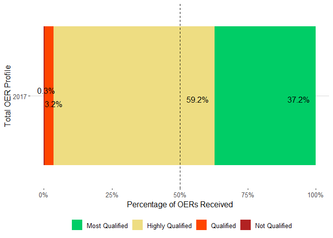

## OER Analysis


##Total Number of OERs in 2017 by Branch 


## Distribution of OERs by Senior Rater Label Block Check

```r
oers1c = oers1 %>% 
  group_by(srLabel) %>% 
  tally() %>% 
  mutate(year = "2017") %>% 
  mutate(pct=n/sum(n))

ggplot(data = oers1c,mapping = aes(x = year, y= pct,fill = srLabel))+
  geom_bar(stat = "identity")+
  geom_text_repel(aes(label = scales::percent(pct)), position = "stack",
                  size = 4.25, hjust = 1.25, vjust = 1) +
  #geom_text_repel(aes(label = paste(as.character(signif(100*pct, 3))) + "%"), position = "stack",
                  #size = 4.25, hjust = 1.25, vjust = 1)+
  geom_abline(intercept = .5, slope = 0, linetype = 2)+
  theme_hc() +
  scale_colour_hc()+
  scale_fill_hc()+
  xlab("Total OER Profile")+
  ylab("Percentage of OERs Received")+
  labs(fill = "")+
  #ggtitle("Distribution of OERS in 2017") + 
  scale_y_continuous(labels=percent) +
  scale_fill_manual(values=c("Most Qualified"="springgreen3", "Highly Qualified"="lightgoldenrod", "Qualified"="orangered1", "Not Qualified"="firebrick")) +
  coord_flip()
```

```
## Scale for 'fill' is already present. Adding another scale for 'fill',
## which will replace the existing scale.
```

<!-- -->

##Distribution of OERs Across Base Branches

```r
oers1a = oers1 %>% 
  group_by(branch, srLabel) %>% 
  tally() %>% 
  mutate(pct = n/sum(n))

oers1b = oers1a %>% group_by(branch) %>% filter(branch %in% base_branch) %>%  filter(sum(n)>100)

ggplot(data = oers1b,mapping = aes(x = branch, y= pct,fill = srLabel))+
  geom_bar(stat= "identity")+
  geom_abline(intercept = .5, slope = 0, linetype = 2)+
  theme_hc() +
  scale_colour_hc()+
  scale_fill_hc()+
  xlab("Branch")+
  ylab("Percentage of OERs Received")+
  labs(fill = "")+
  #ggtitle("Distribution of OERS for Braches with Greater than 100 OERS in 2017") +
  scale_y_continuous(labels=percent)+
  scale_fill_manual(values=c("Most Qualified"="springgreen3", "Highly Qualified"="lightgoldenrod", "Qualified"="orangered1", "Not Qualified"="firebrick"))
```

```
## Scale for 'fill' is already present. Adding another scale for 'fill',
## which will replace the existing scale.
```

<!-- -->

#TF-IDF Plot

```r
#####TEXT ANALYSIS###############

#SENIOR NARRATIVES
tidy_oer_senior = oers1 %>% unnest_tokens(srNarrativeWords, srNarrative) %>% 
  anti_join(stop_words, by = c("srNarrativeWords" ="word")) %>% count(branch, srNarrativeWords, sort = TRUE)
tidy_oer_senior <- tidy_oer_senior[!grepl(".*xx.*", tidy_oer_senior$srNarrativeWords),]


###TF_IDF ANALYSIS of One Word####

tidy_idf_senior = tidy_oer_senior %>% bind_tf_idf(srNarrativeWords, branch, n)
tidy_idf_senior = tidy_idf_senior %>% arrange(desc(tf_idf))


#Combat Arms and Support, SORTED#
combined_tf_ordered <-
  tidy_idf_senior %>%
  filter(branch %in% combat_support) %>%
  mutate(srNarrativeWords = factor(srNarrativeWords, levels = rev(unique(srNarrativeWords)))) %>% 
  group_by(branch) %>%
  top_n(10) %>% 
  ungroup() %>% 
  arrange(branch, tf_idf) %>% 
  mutate(order = row_number())
```

```
## Selecting by tf_idf
```

```r
combined_tf_ordered$branch <-  factor(combined_tf_ordered$branch, 
                                      levels = c("IN", "AR", "FA", "QM", "TC", "OD"))

###TF-IDF FINAL GRAPH###
tf_idf_word_plot <- ggplot(combined_tf_ordered, aes(order, tf_idf, fill = branch)) +
  geom_bar(stat = 'identity', show.legend = FALSE) +
  labs(x = NULL, y = "tf-idf") +
  facet_wrap(~branch, ncol = 3, scales = "free") +
  theme_hc() +
  coord_flip()+
  scale_colour_hc()+
  scale_fill_hc() +
  scale_x_continuous(
    breaks = combined_tf_ordered$order,
    labels = paste0(combined_tf_ordered$srNarrativeWords),
    expand = c(0,0)
  ) +
  ggtitle("Tf-Idf By Branch")

tf_idf_word_plot
```

<!-- -->

